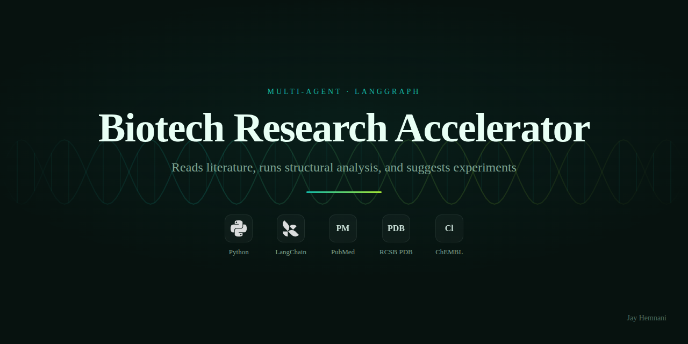

# Biotech Research Accelerator

[](https://github.com/jayhemnani9910/biotech-accelerator/actions/workflows/ci.yml)
[](https://www.python.org/downloads/)
[](LICENSE)
[](https://github.com/astral-sh/ruff)

## Demo

Interactive demo: **[jayhemnani9910.github.io/biotech-accelerator](https://jayhemnani9910.github.io/biotech-accelerator/)**



A multi-agent AI system that doesn't just READ about biology - it ANALYZES molecular data, cross-references literature with computational evidence, and suggests experiments.

## What Makes It Different

Current research agents (OpenAI Deep Research, Gemini, etc.) can **read** about biology.

This system can **read + analyze + recommend**:

```
User: "What mutations stabilize lysozyme? Analyze PDB 1LYZ"
         ↓
[PARSER] Extract proteins, PDB IDs, detect query type
         ↓
[UNIPROT] Resolve protein names → UniProt IDs → PDB structures
         ↓
[PUBMED] Search literature for mutations and stability data
         ↓
[STRUCTURE] Fetch PDB, run ANM/GNM analysis for flexibility
         ↓
[CHEMBL] Search for active compounds (if drug query detected)
         ↓
[SYNTHESIS] Cross-reference mutations with flexible regions
         ↓
[EXPERIMENTS] Generate actionable experiment suggestions
         ↓
Final Report with citations, structural insights, and next steps
```

## Features

### 1. Literature Analysis
- PubMed search with proper query construction
- Mutation extraction from abstracts (e.g., V600E, L858R)
- Relevance scoring and deduplication
- Rate limiting and retry logic

### 2. Structural Analysis
- PDB structure fetching from RCSB
- Normal Mode Analysis (ANM/GNM) via ProDy
- Flexibility profiling (flexible/rigid regions)
- Hinge residue identification

### 3. Drug Discovery
- ChEMBL integration for bioactivity data
- Target-based compound search
- Potency classification (<10nM, 10-100nM, etc.)
- Known drug identification

### 4. Intelligent Synthesis
- Cross-reference mutations with structure
- Map mutations to flexible/rigid regions
- Identify hinge-affecting mutations
- Generate experiment suggestions

## Installation

```bash
# Clone the repo
git clone https://github.com/jayhemnani9910/biotech-accelerator.git
cd biotech-accelerator

# Create virtual environment
python -m venv .venv
source .venv/bin/activate

# Install dependencies
pip install -e ".[dev]"
```

### Dependencies
- Python 3.10+
- ProDy (Normal Mode Analysis)
- httpx (async HTTP client)
- LangGraph (workflow orchestration)
- Rich (terminal formatting)

### Docker

Avoids the pain of building ProDy, RDKit, and torch-geometric natively:

```bash
docker build -t biotech-accelerator .
docker run --rm -it --env-file .env biotech-accelerator
```

## Configuration

The current pipeline is deterministic and does not require an LLM API key. LLM-
powered nodes are planned for a later iteration (see the project plan).

| Variable | Required | Default | Purpose |
|----------|----------|---------|---------|
| `PUBMED_EMAIL` | recommended | `biotech-accelerator@example.com` | Contact email sent with NCBI PubMed requests; avoids rate-limit throttling. |
| `PUBMED_API_KEY` | no | — | NCBI API key for higher PubMed rate limits. |
| `PDB_CACHE_DIR` | no | `~/.biotech-accelerator/pdb_cache` | Local directory for cached PDB structure files. |

UniProt, RCSB PDB, and ChEMBL require no API key.

## Usage

### Python API

```python
import asyncio
from biotech_accelerator.graph.biotech_graph import run_research

async def main():
    # Stability research
    result = await run_research("What mutations stabilize lysozyme?")
    print(result["final_report"])

    # Drug discovery
    result = await run_research("Find inhibitors for EGFR kinase")
    print(result["final_report"])

asyncio.run(main())
```

### CLI

```bash
# Run the full pipeline end-to-end
biotech "What mutations stabilize lysozyme?"

# Machine-readable JSON (ideal for piping into coding agents)
biotech "Find EGFR inhibitors" --json

# Analyze one or more PDB IDs directly
biotech --pdb 1LYZ 4HHB
biotech --pdb 1LYZ --json

# Run integration tests (hits live APIs)
pytest -m integration
```

### Use with Claude Code (MCP)

The repository ships an MCP server so Claude Code (or any MCP-compatible
client) can call the biotech pipeline as native tools. The server is
registered via `.mcp.json` at the repo root; point Claude Code at it:

```bash
# Install the package (includes the `biotech-mcp` entry point)
pip install -e .

# Launch Claude Code from the repo root — it picks up .mcp.json automatically.
# Claude Code then exposes these tools under the `mcp__biotech__*` namespace:
#   search_literature, search_literature_by_protein, resolve_protein,
#   fetch_structure, run_nma, search_compounds_by_target, get_compound,
#   get_approved_drugs_for_target, extract_mutations,
#   cross_reference_mutations, run_research
```

Project-local slash commands in `.claude/commands/` provide ready-made
workflows:

- `/research "<question>"` — full pipeline + synthesis
- `/analyze-pdb <pdb_id> [...]` — NMA dynamics summary
- `/find-mutations "<protein>"` — literature-reported mutations mapped to structure

## Example Queries

| Query | What It Does |
|-------|--------------|
| "What mutations stabilize lysozyme?" | Literature + structure analysis |
| "Analyze PDB 1LYZ" | NMA flexibility analysis |
| "Find EGFR inhibitors" | ChEMBL drug search |
| "BRAF V600E mutation analysis" | Combined research |

## Architecture

```
biotech-accelerator/
├── biotech_accelerator/
│   ├── adapters/           # API integrations
│   │   ├── pdb_adapter.py      # RCSB PDB
│   │   ├── pubmed_adapter.py   # NCBI PubMed
│   │   ├── uniprot_adapter.py  # UniProt
│   │   └── chembl_adapter.py   # ChEMBL
│   │
│   ├── agents/nodes/       # LangGraph agents
│   │   ├── structure_analyst.py
│   │   ├── bio_literature.py
│   │   ├── drug_binding.py
│   │   ├── synthesis.py
│   │   └── experiment_suggester.py
│   │
│   ├── analysis/           # Computational wrappers
│   │   └── nma_wrapper.py      # ProDy ANM/GNM
│   │
│   ├── domain/             # Data models
│   │   ├── protein_models.py
│   │   └── compound_models.py
│   │
│   ├── graph/              # LangGraph workflow
│   │   └── biotech_graph.py
│   │
│   ├── ports/              # Data models
│   │   ├── structure.py
│   │   ├── sequence.py
│   │   ├── literature.py
│   │   └── compound.py
│   │
│   └── utils/              # Utilities
│       └── cache.py            # Response caching
│
├── examples/               # Example scripts
├── tests/                  # Unit + integration tests
└── README.md
```

## Pipeline Flow

```
parse_query_node
       ↓
resolve_proteins_node (UniProt → PDB mapping)
       ↓
literature_node (PubMed search)
       ↓
structure_node (PDB + NMA analysis)
       ↓
drug_node (ChEMBL search, if drug query)
       ↓
synthesis_node (combine all evidence + experiments)
       ↓
     END
```

## Data Sources

| Source | Data Type | Status |
|--------|-----------|--------|
| PubMed | Research papers | ✅ Working |
| RCSB PDB | Protein structures | ✅ Working |
| UniProt | Sequences, annotations | ✅ Working |
| ChEMBL | Compound bioactivity | ✅ Working |
| ProDy | ANM/GNM analysis | ✅ Working |

## Performance Features

- **Caching**: API responses cached for 24h
- **Rate limiting**: PubMed requests throttled to avoid 429 errors
- **Retry logic**: Automatic retry with exponential backoff
- **Parallel search**: Multiple protein-specific searches

## Example Output

```
# Biotech Research Report

**Query:** What mutations stabilize lysozyme? Analyze PDB 1LYZ

## Literature Evidence
- 5 papers found
- 1 mutation identified: D67H

## Computational Analysis
**Analyzed structures:** 1LYZ

**Flexibility Profile:**
- Mean fluctuation: 0.145 Ų
- Flexible regions: 44-49, 66-72, 100-102
- Hinge residues: 45, 46, 47, 48, 49

## Synthesis & Insights
- D67H is in a flexible region
- May alter local dynamics

## Suggested Experiments

### 1. Engineer stabilizing mutations in rigid core
**Methods:**
- Design conservative mutations in rigid core
- Use Rosetta for ΔΔG predictions
- Measure stability via DSF thermal melt

### 2. Probe hinge dynamics at positions 45, 46, 47
**Methods:**
- Design Gly→Pro mutations to rigidify
- Use NMR relaxation to probe dynamics
```

## Contributing

This project combines several repositories:
- `revolu-idea`: Multi-agent orchestration
- `nobel-dataintelligence`: Molecular analysis

See [CONTRIBUTING.md](CONTRIBUTING.md) for dev setup and PR guidelines.

## License

MIT
